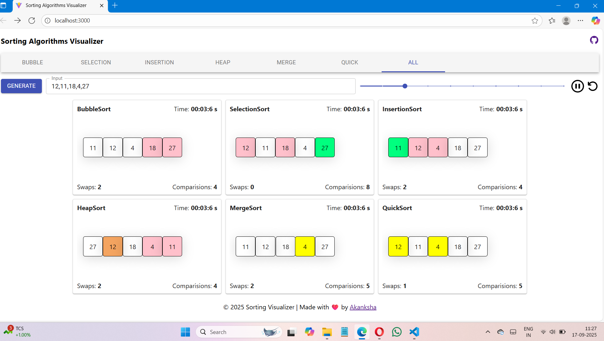
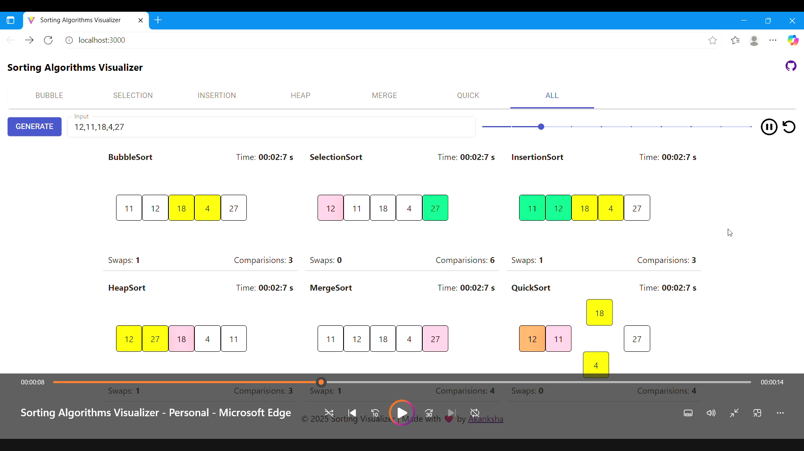
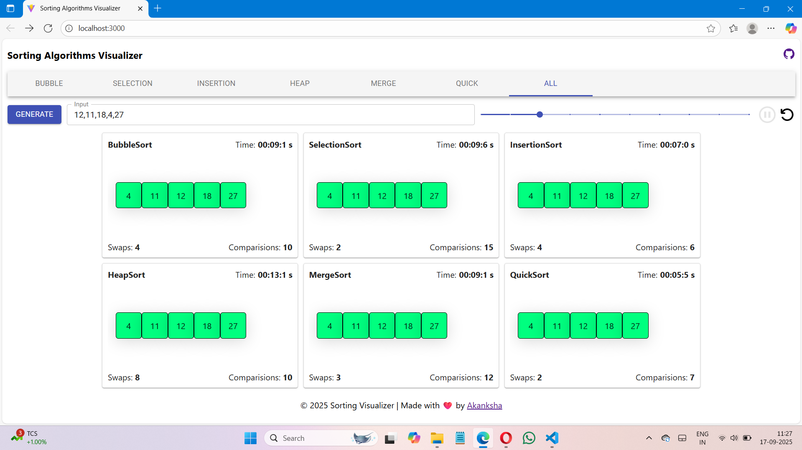
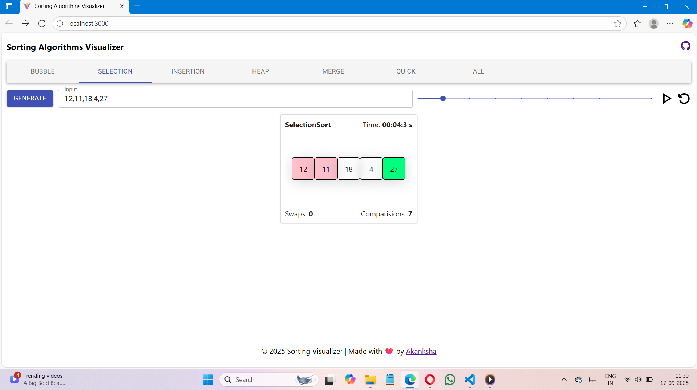

# Sorting Visualizer(Visualizing_Sorting_Algorithm)

This web application is designed to provide an interactive visualization of various sorting algorithms. Watch the algorithms in action, explore real-time statistics, and gain insights into the sorting process.


## Features

- **Interactive Sorting Visualizations:** Dynamic and visually appealing animations represent each element's movement during the sorting process.

- **Multiple Sorting Algorithms:** Choose from a variety of sorting algorithms, including insertion sort, heap sort, selection sort, bubble sort, quicksort, merge sort, and more.

- **Real-time Statistics:** Monitor sorting progress with real-time statistics such as total swaps, total comparisons, and approximate time taken for comparison.

## Technologies Used

- **React JS:** Built using React JS, a powerful JavaScript library for building user interfaces.

- **Styled Components:** Utilizing Styled Components for a modular and maintainable styling approach allows to write css in js.

- **React Hooks:** mijor use of useStae and useEffect hooks for rendering of UI.

- **React Icons:** Integrating React Icons for scalable and visually appealing icons.

- **JSX:** Syntax extension for js that allows to write html code in js .

- **React-Use:** Utilizing React-Use library for additional hooks and utilities.

## Getting Started with our project

Follow these steps to get SortVista-Visualizing_Sorting_Algorithm up and running on your local machine:

1. **Clone the Repository:**
   ```bash
   git clone https://github.com/akankshal14/Sorting_Visualizer.git
   cd Sorting_Visualizer
   ```

2. **Install Dependencies:**
   ```bash
   npm install
   ```

3. **Run the Development Server:**
   ```bash
   npm run dev
   ```

4. **Open in Browser:**
   Open your browser and navigate to `http://localhost:3000` to experience SortVista-Visualizing_Sorting_Algorithm.

## Contributing

Contributions are welcome! Feel free to submit issues, feature requests, or pull requests. Your input is highly appreciated.


Explore the world of sorting algorithms with SortVista! 🚀


# Implementation Screenshots







